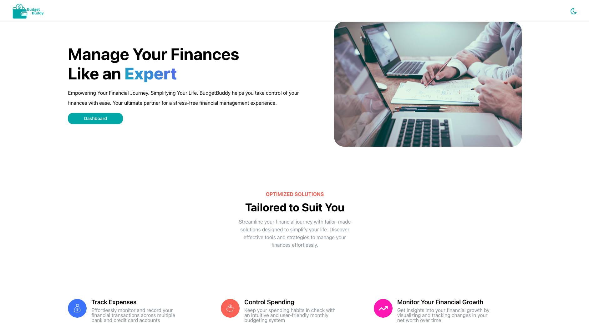

<!-- Improved compatibility of back to top link: See: https://github.com/othneildrew/Best-README-Template/pull/73 -->

<a name="readme-top"></a>

<!--
*** Thanks for checking out the Best-README-Template. If you have a suggestion
*** that would make this better, please fork the repo and create a pull request
*** or simply open an issue with the tag "enhancement".
*** Don't forget to give the project a star!
*** Thanks again! Now go create something AMAZING! :D
-->

<!-- PROJECT SHIELDS -->
<!--
*** I'm using markdown "reference style" links for readability.
*** Reference links are enclosed in brackets [ ] instead of parentheses ( ).
*** See the bottom of this document for the declaration of the reference variables
*** for contributors-url, forks-url, etc. This is an optional, concise syntax you may use.
*** https://www.markdownguide.org/basic-syntax/#reference-style-links
-->

[![Contributors][contributors-shield]][contributors-url]
[![Stargazers][stars-shield]][stars-url]
[![LinkedIn][linkedin-shield]][linkedin-url]

<!-- PROJECT LOGO -->
<br />
<div align="center">
  <a href="https://github.com/Abi-Liu/Spendify">
    
  </a>

<h3 align="center">Budget Buddy</h3>

  <p align="center">
    Simplifying Your Finances: Your Ultimate Companion for Seamless Financial Management
    <br />
    <a href="#usage"><strong>How to use »</strong></a>
    <br />
    <br />
    <a href="https://www.bbapi.online">Live Site</a>
    ·
    <a href="https://github.com/Abi-Liu/Spendify/issues">Report Bug</a>
    ·
    <a href="https://github.com/Abi-Liu/Spendify/issues">Request Feature</a>
  </p>
</div>

<!-- TABLE OF CONTENTS -->
<details>
  <summary>Table of Contents</summary>
  <ol>
    <li>
      <a href="#about-the-project">About The Project</a>
      <ul>
        <li><a href="#built-with">Built With</a></li>
      </ul>
    </li>
    <li>
      <a href="#getting-started">Getting Started</a>
      <ul>
        <li><a href="#prerequisites">Prerequisites</a></li>
        <li><a href="#installation">Installation</a></li>
      </ul>
    </li>
    <li><a href="#usage">Usage</a></li>
    <li><a href="#contributing">Contributing</a></li>
    <li><a href="#license">License</a></li>
    <li><a href="#contact">Contact</a></li>
  </ol>
</details>

<!-- ABOUT THE PROJECT -->

## About The Project



This project is a new and improved version of my previous personal finance app, [Finance Me](https://github.com/Abi-Liu/Finance-Me). In this iteration, I'm focusing on creating more features and a better user experience, as well as learning to use new technologies, such as Docker, Postgres, Redis, WebSockets, and AWS.

Users will be able to create an account and link their multiple bank and credit card accounts through Plaid. They will then be able to view a comprehensive summary of the state of their finances, such as their net worth, assets and liabilities, transaction details, and so on. There is also an option to export transactions to CSV with the export-to-CSV feature. This functionality allows you to conveniently export transaction information, providing you with greater flexibility and control over your financial data. You can also create monthly budgets to keep your expenses in check and all of these features are beautifully displayed through graphs and tables for easy data visualization. I have also added real-time notifications for new transaction data via WebSockets, this way users are always up to date with their latest financial activities.

Another key improvement from my last iteration is the ability to reauthenticate your connected accounts. This way, you won't have to manually delete and re-link your financial accounts which was a big headache for users.

<p align="right">(<a href="#readme-top">back to top</a>)</p>

### Built With

- [![TypeScript][typescript]][typescript-url]
- [![React][React.js]][React-url]
- [![Node][node.js]][node-url]
- [![Express][express]][express-url]
- [![Docker][docker]][docker-url]
- [![Nginx][nginx]][nginx-url]
- [![PostgreSQL][postgres]][postgres-url]
- [![Redis][redis]][redis-url]
- [![Socket.io][socketio]][socketio-url]
- [![AWS][aws]][aws-url]

<p align="right">(<a href="#readme-top">back to top</a>)</p>

<!-- GETTING STARTED -->

## Getting Started

To get a local copy up and running follow the steps below.

### Prerequisites

Before you begin, ensure you have the following technologies installed:

1. **Node.js and npm:**
   - Download and install Node.js and npm from [https://nodejs.org/](https://nodejs.org/)

2. **Docker:**
   - Install Docker by following the instructions on [https://www.docker.com/get-started](https://www.docker.com/get-started)
  
3. **Ngrok:**
   - Ngroks is required to receive Plaid's HTTPS webhooks in localhost for the real-time notifications to function. It creates a tunnel to the internet for our local server. This allows our server to receive and respond to the Plaid webhooks. 
   - Download Ngrok by following the instructions on [https://ngrok.com/download](https://ngrok.com/download).
   - Register for a free account. Once you are done, click on the `Your Auth Token` link on the sidebar and follow the configuration steps.

### Installation

1. You will need to get a few free API keys to get up and running. For more information, check out the `.env.example` file and follow the instructions to get your Plaid and Google API keys and secrets.
2. Clone the repo
   ```sh
   git clone https://github.com/Abi-Liu/Spendify.git
   ```
3. Install dependencies for both client and server directories.
   _Server:_

   ```sh
   cd server
   npm install
   ```

   _Client:_

   ```sh
   cd client
   npm install
   ```

4. Create a new `.env` file in the root directory of the project. Copy the contents from the `.env.example` file and add your own Plaid and Google API keys.
   ```md
   PLAID_SECRET="YOUR_PLAID_SECRET"
   etc...
   ```
5. Start up a new Ngrok tunnel by running this command in your command line:
   ```sh
   ngrok http http://localhost:8000
   ```

   Copy the forwarding link, it should look like `https://....ngrok-free.app`. Navigate to `/server/src/controllers/plaid.ts` and change the webhook URL to your new Ngrok forwarding URL. Be sure to keep the `/webhook/` at the end of it.

   It should look something like this: `"https://951e-3100-2410-s210-90b0-6868-2889-d439-3e05.ngrok-free.app/webhook/"`

   Now you will be able to receive webhooks on your local server.
   
6. You're now ready to spin up your own local containers.

   ```sh
   docker-compose up
   ```

   This command will start the Docker containers for Nginx, PostgreSQL, Redis, the Node.js server, and the React client.

   It may take some time to orchestrate the containers for the first time, but just sit back and eventually, you should see:

   ```sh
   server_2-1  | Server has started on port: 8000
   server_1-1  | Server has started on port: 8000
   ```

   And that's it! Everything should be up and running. Now you can navigate to `http://localhost:5173` and see your own local copy.

<p align="right">(<a href="#readme-top">back to top</a>)</p>

<!-- USAGE EXAMPLES -->

## Usage

Click [here](https://www.loom.com/share/5703cbedc11b47c9a163cb9ad16c3d2d?sid=1dfb840e-bc00-4bf2-9732-ee4549e12e91) to see a full demo video showcasing the features!

During development and for demonstration purposes, this project uses Plaid's sandbox mode. Sandbox mode enables you to test, develop, and interact with its functionalities in a controlled environment.

To connect to most institutions, you can simply leave all credential fields blank and just select the accounts you wish to connect. If Plaid is requiring you to enter credentials, you can just the ones provided below:

```md
username: user_good
password: pass_good
pin: credential_good (when required)
```

To trigger the link flow on desktop, simply click the turquoise `+` sign on the top right of the sidebar.


For mobile screens, there will be a hamburger icon on the far left of the header. Click on that to expand the sidebar and the same `+` will be there to trigger the link flow.


To get a full picture of your financial data, there will also be options to add assets: i.e. cars, properties, investments, etc. To get there, you just need to click on the user menu at the bottom of the sidebar, click on the `Assets` option, and enter the name and value.


<p align="right">(<a href="#readme-top">back to top</a>)</p>

<!-- ROADMAP -->

<!-- ## Roadmap

- [ ] Feature 1
- [ ] Feature 2
- [ ] Feature 3
  - [ ] Nested Feature -->

<!-- See the [open issues](https://github.com/Abi-Liu/Spendify/issues) for a full list of proposed features (and known issues). -->

<!-- CONTRIBUTING -->

## Contributing

Contributions are what make the open-source community such an amazing place to learn, inspire, and create. Any contributions you make are **greatly appreciated**.

If you have a suggestion that would make this better, please fork the repo and create a pull request. You can also simply open an issue with the tag "enhancement".
Don't forget to give the project a star! Thanks again!

1. Fork the Project
2. Create your Feature Branch (`git checkout -b feature/AmazingFeature`)
3. Commit your Changes (`git commit -m 'Add some AmazingFeature'`)
4. Push to the Branch (`git push origin feature/AmazingFeature`)
5. Open a Pull Request

<p align="right">(<a href="#readme-top">back to top</a>)</p>

<!-- LICENSE -->

## License

Distributed under the MIT License.

<p align="right">(<a href="#readme-top">back to top</a>)</p>

<!-- CONTACT -->

## Contact

Abi Liu - [LinkedIn](https://www.linkedin.com/in/abiliu/) - abiliu018@gmail.com

Project Link: [https://github.com/Abi-Liu/Spendify](https://github.com/Abi-Liu/Spendify)

<p align="right">(<a href="#readme-top">back to top</a>)</p>

<!-- MARKDOWN LINKS & IMAGES -->
<!-- https://www.markdownguide.org/basic-syntax/#reference-style-links -->

[contributors-shield]: https://img.shields.io/github/contributors/Abi-Liu/Spendify.svg?style=for-the-badge
[contributors-url]: https://github.com/Abi-Liu/Spendify/graphs/contributors
[forks-shield]: https://img.shields.io/github/forks/Abi-Liu/Spendify.svg?style=for-the-badge
[forks-url]: https://github.com/Abi-Liu/Spendify/network/members
[stars-shield]: https://img.shields.io/github/stars/Abi-Liu/Spendify.svg?style=for-the-badge
[stars-url]: https://github.com/Abi-Liu/Spendify/stargazers
[issues-shield]: https://img.shields.io/github/issues/Abi-Liu/Spendify.svg?style=for-the-badge
[issues-url]: https://github.com/Abi-Liu/Spendify/issues
[license-shield]: https://img.shields.io/github/license/Abi-Liu/Spendify.svg?style=for-the-badge
[license-url]: https://github.com/Abi-Liu/Spendify/blob/master/LICENSE.txt
[linkedin-shield]: https://img.shields.io/badge/-LinkedIn-black.svg?style=for-the-badge&logo=linkedin&colorB=555
[linkedin-url]: https://linkedin.com/in/abiliu
[product-screenshot]: images/screenshot.png
[React.js]: https://img.shields.io/badge/React-20232A?style=for-the-badge&logo=react&logoColor=61DAFB
[React-url]: https://reactjs.org/
[node.js]: https://img.shields.io/badge/Node.js-43853D?style=for-the-badge&logo=node.js&logoColor=white
[node-url]: https://nodejs.org/en
[express]: https://img.shields.io/badge/Express.js-404D59?style=for-the-badge
[express-url]: https://expressjs.com/
[docker]: https://img.shields.io/badge/Docker-2CA5E0?style=for-the-badge&logo=docker&logoColor=white
[docker-url]: https://www.docker.com/
[postgres]: https://img.shields.io/badge/PostgreSQL-316192?style=for-the-badge&logo=postgresql&logoColor=white
[postgres-url]: https://www.postgresql.org/
[redis]: https://img.shields.io/badge/redis-%23DD0031.svg?&style=for-the-badge&logo=redis&logoColor=white
[redis-url]: https://redis.io/
[socketio]: https://img.shields.io/badge/Socket.io-010101?&style=for-the-badge&logo=Socket.io&logoColor=white
[socketio-url]: https://socket.io/
[aws]: https://img.shields.io/badge/Amazon_AWS-FF9900?style=for-the-badge&logo=amazonaws&logoColor=white
[aws-url]: https://aws.amazon.com/
[nginx]: https://img.shields.io/badge/Nginx-009639?style=for-the-badge&logo=nginx&logoColor=white
[nginx-url]: https://www.nginx.com/
[typescript]: https://img.shields.io/badge/TypeScript-007ACC?style=for-the-badge&logo=typescript&logoColor=white
[typescript-url]: https://www.typescriptlang.org/
